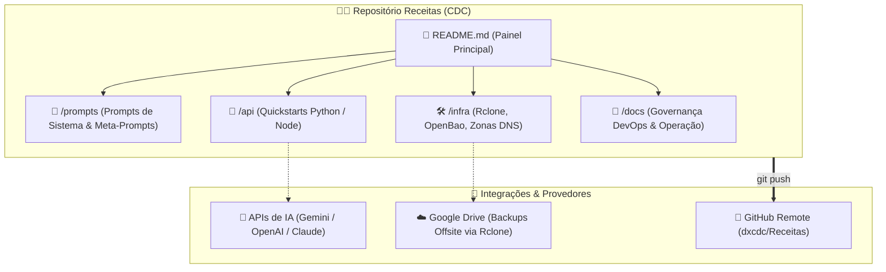

# 🧑‍🍳 Receitas de IA & Infraestrutura (CDC Recipes)

*Repositório centralizado de boilerplates, configurações de infraestrutura, prompts de sistema e padrões de código de IA para cópia rápida em novos projetos.*

---

## 📐 Arquitetura do Repositório

---

## 📂 Navegação de Diretórios

Clique nas pastas abaixo para navegar pelo conteúdo direto no repositório:

| Diretório | Descrição | Conteúdo sugerido |
| :--- | :--- | :--- |
| [📂 **docs/**](./docs) | **Governança & Sustentação DevOps** | 9 arquivos oficiais de diretrizes, backups, postmortem e ajuda técnica. |
| [📂 **prompts/**](./prompts) | **Prompts de Sistema & Meta-Prompts** | Prompts de codificação, geradores de documentação e engenharia de prompt. |
| [📂 **api/**](./api) | **Boilerplates de Integração de APIs** | Scripts prontos para Gemini API com streaming e Structured Outputs (Pydantic). |
| [📂 **infra/**](./infra) | **Arquitetura, Backups & Segurança** | Guia Rclone/GDrive, Cofres OpenBao/Vaultwarden, Zonas DNS e E-mail. |
| [📂 **mcp/**](./mcp) | **Servidores MCP (Model Context Protocol)** | Modelos básicos para criar e estender servidores MCP. |
| [📂 **agents/**](./agents) | **Loops e Frameworks de Agentes** | Arquiteturas simples de agentes autônomos e tool use. |
| [📂 **ui/**](./ui) | **Interfaces Rápidas de Prototipagem** | Templates Streamlit, HTML/CSS ou Gradio para testes rápidos. |

---

## 📑 Índice de Receitas Ativas

### 💬 Prompts & Governança
* ✍️ **[Meta-Prompt Mestre: Documentação Universal, DevOps & Governança](./prompts/meta_prompt_documentacao.md)**: **[RECOMENDADO]** O Prompt Mestre Definitivo para copiar e colar no início de novos projetos. Instruí IAs a analisar o repositório e criar a estrutura completa dos arquivos em `docs/`, `README.md` com Mermaid, backup 3-2-1 e modelo híbrido de escrita.
* 🔌 **[System Prompt de Codificação](./prompts/system_prompts.md)**: Prompt de sistema robusto para configurar LLMs para atuar como desenvolvedores seniores em tarefas de programação.

### 🐍 Integrações de API
* 🚀 **[Gemini Quickstart (Python)](./api/gemini_quickstart.py)**: Template em Python para iniciar rapidamente chamadas com a API do Gemini, suportando respostas em streaming e Structured Outputs (JSON).

### 🛠️ Infraestrutura & Segurança
* 📦 **[Backup Automatizado Rclone + Google Drive](./infra/estrategia_backup_rclone_gdrive.md)**: Guia de backup offsite incremental com Rclone no Google Drive e alertas em webhook para Mattermost/Discord/Slack.
* 🔐 **[Cofres Híbridos (Vaultwarden + OpenBao)](./infra/cofres_segredos_openbao_vaultwarden.md)**: Gestão de credenciais humanas vs máquinas, segredos dinâmicos com tempo de vida (TTL) e subdomínios ofuscados.
* 🌐 **[Checklist de Zonas DNS & E-mail Corporativo](./infra/dns_email_domain_checklist.md)**: Tabela de referência DNS para subdomínios de VPS, Vercel, Google Workspace, Postal SMTP, SPF, DKIM e DMARC.

---

## 📖 Documentação Oficial do Repositório (`docs/`)

Consulte as diretrizes e manuais técnicos de governança deste repositório:

- 📖 **[Diretrizes de Documentação](./docs/diretrizes_documentacao.md)**: Regras editoriais, tom corporativo amigável e tabela de decisões ADR.
- 🚀 **[Estratégia de Execução & Git](./docs/estrategia_execucao.md)**: Fluxo de branches, padrão de commits e plano de rollback.
- 🚚 **[Guia de Migração & Onboarding](./docs/migration_guide.md)**: Passo a passo para clonagem e execução em novas máquinas.
- 🛠️ **[Ajuda Infra & Cheat Sheet](./docs/ajuda_infra.md)**: Mapeamento de diretórios e comandos rápidos de terminal.
- 📝 **[Registro de Postmortem](./docs/postmortem.md)**: Histórico incremental de incidentes e lições aprendidas (Cultura Blameless).
- 🔍 **[Troubleshooting](./docs/troubleshooting.md)**: Diagnóstico e resolução de problemas comuns.
- 💾 **[Política de Backup 3-2-1](./docs/politica_backup.md)**: Regras de redundância offsite e logs de testes de restore.
- 🎨 **[Plano de Personalização](./docs/plano_personalizacao.md)**: Roteiro para criação de novas categorias de receitas.
- 🤖 **[Prompt IA Context](./docs/prompt_ia.md)**: Diretrizes permanentes para assistentes de IA interagirem com o repositório.

---

## 🔒 Auditoria de Segurança

> [!IMPORTANT]
> Este repositório é auditado para garantir que **nenhuma credencial real, senha, chave privada ou webhook sensível** seja exposto. Todos os arquivos de exemplo usam variáveis de ambiente (`os.getenv`) ou placeholders genéricos (ex: `<MATTERMOST_WEBHOOK_URL>`, `sua_chave_api_aqui`).

---

## 🛠️ Como Usar e Copiar

1. **Navegue** até o diretório da receita desejada clicando nas tabelas acima.
2. **Copie** o código ou prompt relevante.
3. **Cole** no seu novo projeto.

> [!TIP]
> Ao adicionar novas receitas, mantenha os scripts independentes e auto-contidos para que a cópia seja o mais simples possível.
